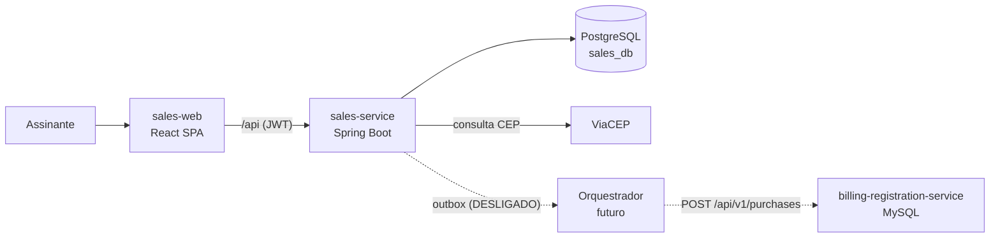

# sales-platform

Plataforma de **vendas de assinaturas e produtos**: vitrine, cadastro do assinante,
carrinho (com carrinho abandonado) e tela de compra. É a "porta de entrada" das
vendas que, no clique final em **Comprar**, serão entregues ao **orquestrador** e,
por ele, ao [`billing-registration-service`](https://github.com/angelosemitela/billing-registration-service).

> Projeto de estudo e portfólio. Cada decisão tem o "porquê" explicado aqui, no
> código e nas migrations, junto com alternativas para estudo futuro.

| Pasta | O que é | Stack |
|---|---|---|
| [`sales-service/`](sales-service) | API REST | Java 25, Spring Boot 4.1, Spring Security (JWT), Spring Data JPA, PostgreSQL, Flyway |
| [`sales-web/`](sales-web) | Front-end SPA | React 19, TypeScript, Vite, TanStack Query, React Hook Form + Zod, Tailwind CSS |

---

## Sumário

1. [Arquitetura](#arquitetura)
2. [Como rodar](#como-rodar)
3. [Banco de dados](#banco-de-dados)
4. [API](#api)
5. [Regras implementadas](#regras-implementadas)
6. [Decisões tomadas em pontos ambíguos](#decisões-tomadas-em-pontos-ambíguos)
7. [Testes](#testes)
8. [Próximos passos e alternativas para estudo](#próximos-passos-e-alternativas-para-estudo)

---

## Arquitetura



**Backend organizado por funcionalidade** (package-by-feature), e não por camada:

```
com.aalvarenga.sales
├── auth/            login (e-mail + senha) e emissão do JWT
├── subscriber/      cadastro do assinante (conta, documento, endereço, telefone)
├── reference/       países e tipos de documento
├── address/         consulta de CEP (porta + adapter ViaCEP)
├── catalog/         produtos e planos
├── pricing/         cálculo de preço, taxas, trial e parcelas (classe pura)
├── purchase/        carrinho, carrinho abandonado e checkout
├── integration/
│   ├── billing/        tradução para o contrato do billing
│   └── orchestration/  porta de submissão + Transactional Outbox + relay
├── feature/         feature toggles e parâmetros (no banco)
└── shared/          erros (Problem Details) e fuso de negócio
```

**Arquitetura hexagonal (portas e adapters) onde há dependência externa:**

| Porta | Adapter atual | Trocar por... |
|---|---|---|
| `ZipCodeLookupPort` | `ViaCepZipCodeAdapter` | BrasilAPI, Correios, base própria |
| `PurchaseSubmissionPort` | `OutboxPurchaseSubmissionAdapter` | chamada REST direta ao billing |
| `OrchestratorPublisher` | `LoggingOrchestratorPublisher` (stub) | Kafka, RabbitMQ, Temporal, Camunda |

### O clique final em "Comprar" (desligado nesta entrega)

```
POST /purchases/{id}/checkout
  └─ toggle CHECKOUT_ENABLED desligado? -> 409 CHECKOUT_DISABLED   <- comportamento atual
  └─ senão, numa ÚNICA transação:
       valida carrinho + método + tokenização
       recalcula a cotação (preço final)
       grava purchase_payment (+ tokens)
       compra -> PROCESSING
       monta o rascunho do payload do billing
       grava evento "PurchaseSubmitted" no outbox_event
OutboxRelayJob (a cada 10s, só com ORCHESTRATION_ENABLED ligado)
  └─ publica os eventos PENDING no orquestrador -> PUBLISHED
```

Por que **outbox** e não chamar o orquestrador direto? Se a compra fosse gravada e
a chamada falhasse (ou o contrário), os dois lados ficariam inconsistentes - o
famoso *dual write*. Gravando o evento na mesma transação, ou tudo acontece ou nada
acontece; a publicação é feita depois, com retentativa. O billing já é idempotente
pelo `protocol`, então uma publicação repetida é segura.

Para ligar a finalização no futuro:

```sql
UPDATE feature_toggle SET enabled = TRUE WHERE name = 'CHECKOUT_ENABLED';
UPDATE feature_toggle SET enabled = TRUE WHERE name = 'ORCHESTRATION_ENABLED';
```

---

## Como rodar

Pré-requisitos: JDK 25, Maven 3.9+, Node 22+, Docker.

```bash
# 1) Banco
docker compose up -d postgres

# 2) Backend (porta 8081; o Flyway cria e popula o schema na subida)
cd sales-service
mvn spring-boot:run

# 3) Front-end (porta 5173; o Vite repassa /api para a 8081)
cd sales-web
npm install
npm run dev
```

Abra http://localhost:5173, crie um cadastro e escolha um produto.

- Swagger UI: http://localhost:8081/swagger-ui.html
- Tudo em containers: `docker compose up -d --build` (front em http://localhost:8088)

CPFs válidos para teste: `52998224725`, `11144477735`, `39053344705`.

---

## Banco de dados

PostgreSQL, com migrations Flyway em `sales-service/src/main/resources/db/migration`:

| Migration | Conteúdo |
|---|---|
| V1 | Referência e configuração: `country`, `document_type`, `document_type_country`, `tax_model`, `tax_model_item`, `feature_toggle`, `config_parameter` |
| V2 | Catálogo: `product`, `product_plan`, `product_plan_payment_method` |
| V3 | Assinantes: `subscriber`, `subscriber_document`, `subscriber_address`, `subscriber_phone` |
| V4 | Compras: `purchase` (carrinho = compra em status `CART`), `purchase_tax`, `purchase_payment`, `purchase_payment_token`, `outbox_event`, `audit_log` + triggers |
| V5 | Carga dos 249 países (nome em pt-BR + DDI) |
| V6 | Carga de documentos x países, modelos de taxa, toggles, parâmetros e catálogo de exemplo |

**Diferenças didáticas em relação ao billing (MySQL):**

| Tema | billing (MySQL) | sales (PostgreSQL) |
|---|---|---|
| Datas | epoch em ms (`BIGINT`) | `TIMESTAMPTZ` (convertido para epoch só ao montar o payload do billing) |
| Booleanos | `CHAR '0'/'1'` | `BOOLEAN` nativo |
| Auditoria | uma tabela `_AU` espelho por tabela | **uma** tabela `audit_log` com a linha antiga em `JSONB` + **uma** função de trigger |
| Unicidade de e-mail | - | índice único **funcional** em `lower(email)` |
| Job de abandono | - | índice **parcial** `WHERE status = 'CART'` |
| Eventos | - | payload em `JSONB` |

A auditoria genérica evita o problema vivido no billing: cada ajuste de coluna
precisava ser replicado à mão na tabela `_AU` correspondente.

### Carrinho e carrinho abandonado

O carrinho **é** a própria compra em `status = CART` (não existe tabela separada):

```
CART ──(30 min sem atividade / abriu outro produto)──> ABANDONED
 └──(Comprar + tokenização)──> PROCESSING ──> COMPLETED | FAILED
```

- `last_step` guarda até onde o assinante chegou (`PRODUCT_SELECTED`, `PLAN_SELECTED`,
  `PAYMENT_METHOD_SELECTED`, `PAYMENT_DETAILS_FILLED`, `SUBMITTED`), o que responde
  "em que passo ele desistiu?".
- `abandon_reason`: `INACTIVITY` (job) ou `REPLACED_BY_NEW_CART`.
- O tempo de inatividade é o parâmetro `CART_ABANDON_MINUTES` (padrão 30), no banco.

```sql
-- Funil de abandono por passo
SELECT last_step, count(*) FROM purchase WHERE status = 'ABANDONED' GROUP BY last_step;
```

---

## API

Base: `/api/v1`. Erros no padrão **Problem Details (RFC 9457)**, com `code` estável:

```json
{ "status": 409, "title": "Conflict", "detail": "E-mail already registered", "code": "EMAIL_ALREADY_REGISTERED" }
```

| Método | Rota | Auth | Descrição |
|---|---|---|---|
| POST | `/auth/login` | - | Login (e-mail + senha) -> JWT |
| POST | `/subscribers` | - | Cadastro (já devolve o JWT) |
| GET | `/subscribers/me` | JWT | Assinante logado |
| GET | `/reference/countries` | - | Países (nome pt-BR + DDI) |
| GET | `/reference/document-types` | - | Tipos de documento e países aceitos |
| GET | `/addresses/zip-codes/{cep}` | - | Consulta de CEP (proxy da ViaCEP) |
| GET | `/catalog` | - | Vitrine com preços já calculados |
| GET | `/features` | - | Toggles do front (`checkoutEnabled`) |
| POST | `/purchases` | JWT | Abre o carrinho (clique no produto) |
| GET | `/purchases/{id}` | JWT | Consulta o carrinho |
| PUT | `/purchases/{id}/selection` | JWT | Atualiza plano, método, carteira, bandeira e parcelas |
| POST | `/purchases/{id}/checkout` | JWT | Finaliza (**desligado**: 409 `CHECKOUT_DISABLED`) |

---

## Regras implementadas

### Mapeamento para o billing (regras gerais 3 a 6)

Implementado em `BillingPurchaseDraftMapper` (testado em `BillingPurchaseDraftMapperTest`):

| billing | Origem no Sales |
|---|---|
| `account[].externalId` | `subscriber.external_id` (UUID gerado no Sales) |
| `account[].name/email/isAuthorizedFallback/document/address/phone` | cadastro do assinante |
| `product[]` | produto + plano (`ONESHOT` -> `type=ONESHOT`; `MONTH/ANNUAL` -> `type=RECURRENCE`) |
| `payment[]` | `purchase_payment` (tokenização) |
| `billing[]` | cotação gravada na compra + `purchase_tax` |
| `protocol` | `purchase.protocol` (`SLS-<uuid>`) |
| `transactionDt` | instante da finalização, em epoch ms |

De onde vem cada dado de pagamento (regra 5):

| Método | issuer | isMultiple / tokens |
|---|---|---|
| CREDIT / DEBIT | tokenização (fim do passo 1) | tokenização |
| PIX | retorno (callback) do pagamento - **fora desta entrega** | - |
| WALLET | fixo: `PicPay` ou `Mercado Pago` | opcional |

### Preço (fonte única: `PricingService`)

```
taxas        = Σ arredondar(productValue × alíquota%)      -- cada taxa em centavos (HALF_UP)
valor cheio  = productValue + taxas                        -- tachado quando há desconto
com desconto = valor cheio − discountValue
cobrado hoje = com desconto, ou 0 em trial
```

É a mesma fórmula que o billing valida (`productValue − discountValue + taxValue = chargedValue`),
e a soma das linhas de taxa bate exatamente com `taxValue`.

| Produto / plano | Produto | Taxas | Cheio | Desconto | Cobrado | Máx. parcelas |
|---|---|---|---|---|---|---|
| TS1 mensal | 25,90 | 3,06 | 28,96 | - | 28,96 | 1 |
| TS1 anual | 268,80 | 31,71 | 300,51 | 30,00 por 1 ano | 270,51 | 12 |
| TS2 mensal | 75,90 | 8,96 | 84,86 | - | 84,86 | 1 |
| TS2 anual | 826,80 | 97,56 | 924,36 | 120,00 por 1 ano | 804,36 | 12 |
| VR1 (boné) | 10,90 | 1,19 | 12,09 | - | 12,09 | **2** (parcela mínima) |

**Parcelas (regra geral 8)**: máximo = o menor entre (a) o máximo do plano, (b) 1 para
DEBIT/PIX e (c) quantas parcelas cabem sem nenhuma ficar abaixo de R$ 5,00
(`MIN_INSTALLMENT_VALUE`, no banco). O boné de R$ 12,09 aceita no máximo 2x, mesmo com o
plano permitindo 12.

### Front-end

| Regra | Onde |
|---|---|
| 1 Login e-mail/senha | `LoginPage` |
| 1.1.1 e-mail válido | `lib/email.ts` (mesma regex do backend) |
| 1.1.2 checkbox "Autorizo ser cobrado..." marcado | `registerSchema.ts` (`isAuthorizedFallback: true`) |
| 1.1.2 documento x país (CPF->BR, SSN->US, UE->27 países, PASSPORT/OTHER->todos) | `RegisterPage` + tabela `document_type_country` |
| 1.1.2.1 CPF: só números + dígitos verificadores | `lib/cpf.ts` (+ `CpfValidator.java` no back) |
| 1.1.3 tipo de endereço, internacional, "Sei meu CEP", campos travados | `RegisterPage` |
| 1.1.3.3 CEP em API de terceiros, libera o que não veio | `ZipCodeController` -> ViaCEP |
| 1.1.3.4 número só dígitos e opcional | `registerSchema.ts` + CHECK no banco |
| 1.1.4 país com DDI + telefone só números até 20 | `RegisterPage` |
| 2.1 clique no produto abre o carrinho | `CatalogPage` -> `POST /purchases` |
| 2.2.1 produto + taxas, tachado com desconto | `PriceSummary` |
| 2.2.2 valor com desconto + duração | `PriceSummary` + `discountDurationText` |
| 2.2.3 trial: data da 1ª cobrança | `PricingService` + `trialText` |
| 2.2.4 dia da recorrência (mensal/anual) | `PricingService` + `recurrenceText` |
| 2.3 métodos do plano, parcelas (padrão = máximo) | `PurchasePage` |
| 2.3.2.1 bandeira automática, recusa não aceitas | `lib/cardBrand.ts` + `CardFields` |
| 2.3.2 WALLET: PicPay / Mercado Pago | `PurchasePage` |
| 2.4 botão Comprar desabilitado | `PurchasePage` (lê `checkoutEnabled` da API) |

---

## Decisões tomadas em pontos ambíguos

| # | Ponto | Decisão |
|---|---|---|
| 1 | Taxas do `taxModel` (ex: CBS 8.8) | **Percentual** sobre o `productValue`, igual à fórmula do billing. |
| 2 | Duração do desconto não existia no catálogo | Coluna `discount_cycles` em `product_plan`; carga com 1 ciclo nos planos com desconto. |
| 3 | Parcela mínima de R$ 5 | Calculada sobre o valor **cobrado** (produto + taxas − desconto). Parametrizada no banco. |
| 4 | Parcelamento por método | Só CREDIT e WALLET parcelam (regra do billing); DEBIT e PIX sempre 1x. |
| 5 | "Taxas registradas em compras separadas" | Tabela `purchase_tax`: cada compra guarda nome, alíquota e valor usados (snapshot), separada das taxas do catálogo. |
| 6 | `isExclusivePurchase` (só no TS1) | Assinante não pode ter 2 compras em `PROCESSING`/`COMPLETED` do mesmo produto. Ausente no catálogo = `false`. |
| 7 | Endereço e telefone no cadastro | Obrigatórios no cadastro do Sales (no billing são opcionais). |
| 8 | Endereço sem número | Permitido; vai para o billing como `S/N` (lá o campo é obrigatório). |
| 9 | "Sei meu CEP" desmarcado | Libera o preenchimento manual do endereço e mostra link de busca dos Correios; o CEP continua obrigatório (o billing exige `zipCode`). |
| 10 | Um carrinho por vez | Abrir o mesmo produto retoma o carrinho; abrir outro produto abandona o anterior (`REPLACED_BY_NEW_CART`). |
| 11 | Número do cartão | Nunca sai do navegador (PCI-DSS). O backend recebe só a bandeira; na finalização, recebe o resultado da tokenização (4 finais, validade, tokens). O `cardNumber` do billing vai mascarado (`************1234`). |
| 12 | `transactionId`/`provider` do billing | Só existem após a captura no gateway: o rascunho vai sem eles e o **orquestrador** completa. |
| 13 | Login | Próprio (BCrypt + JWT HS256, stateless). Keycloak/OIDC como evolução. |
| 14 | Consulta de CEP | Pelo backend (proxy), com timeout de 3s; falha vira 503 e o front libera o preenchimento manual. |

---

## Testes

| Camada | Ferramenta | Onde | Precisa de Docker? |
|---|---|---|---|
| Unidade (back) | JUnit 5 + Mockito + AssertJ | `sales-service/src/test` | Não |
| Unidade/componente (front) | Vitest + Testing Library | `sales-web/src/**/*.test.ts(x)` | Não |
| E2E de interface | Playwright, API simulada com `page.route` | `sales-web/e2e` | Não |

```bash
cd sales-service && mvn verify          # testes + Checkstyle + JaCoCo
cd sales-web && npm test && npm run e2e # (1ª vez: npx playwright install chromium)
```

O CI (`.github/workflows/ci.yml`) roda cada aplicação só quando a pasta dela muda.

---

## Próximos passos e alternativas para estudo

**Próximas entregas naturais**
- Finalização da compra: tokenização com um gateway (ou simulador com WireMock), ligar `CHECKOUT_ENABLED`.
- Orquestrador: consumir `PurchaseSubmitted`, capturar o pagamento, chamar o billing e devolver `COMPLETED`/`FAILED`.
- Callback do PIX (preenche o `issuer`).
- Testes de integração do back com Testcontainers (PostgreSQL real) + Cucumber, no mesmo padrão do billing.
- Backoffice de gestão (catálogo, preços, taxas, relatório de carrinhos abandonados).

**Alternativas por tema**

| Tema | Hoje | Alternativas |
|---|---|---|
| Autenticação | JWT próprio (HS256) | Keycloak/Auth0/Cognito (OIDC), padrão BFF com cookie httpOnly, Spring Authorization Server |
| Orquestração | Outbox + stub | Temporal, Camunda 8 (BPMN), Kafka + máquina de estados, Debezium (CDC) no outbox |
| Front-end | React + Vite (SPA) | Angular, Next.js (SSR/SEO para a loja), Vue/Nuxt |
| Componentes | Tailwind puro | shadcn/ui, Radix, MUI |
| Contrato front/back | tipos TS escritos à mão | geração pelo OpenAPI (orval, openapi-typescript) |
| Cache | - | Caffeine (1 instância), Redis (várias) para catálogo/países/CEP |
| Resiliência | timeout no CEP | Resilience4j (retry, circuit breaker) |
| Jobs agendados | `@Scheduled` idempotente | ShedLock, Quartz em cluster, Kubernetes CronJob |
| Feature toggles | tabela própria | Unleash, FF4j, OpenFeature |
| Mapeamento DTO | manual | MapStruct |
| Banco | PostgreSQL | Redis para carrinho (TTL), OpenSearch para busca, MongoDB como modelo de leitura (CQRS) |
